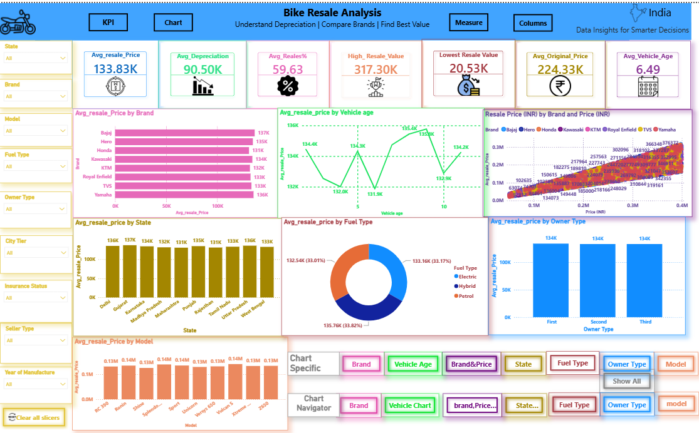
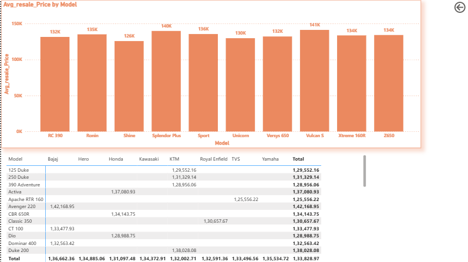

# 🏍️ Bike Sales Analysis in India

Bike Sales Analysis in India using Excel, SQL, and Power BI. This project
analyzes bike prices, resale values, depreciation, vehicle age, brands,
fuel types, ownership, and regional trends through data cleaning,
SQL analysis, KPI calculations, and an interactive Power BI dashboard.

## 📌 Project Overview

This project analyzes bike sales and resale data in India to identify patterns
and insights related to bike prices, resale values, depreciation, vehicle age,
brands, fuel types, ownership types, and locations.

The project uses Excel, SQL, and Power BI for data cleaning, data analysis,
KPI calculation, and interactive visualization.

## 🛠️ Tools Used

- Microsoft Excel
- SQL
- Power BI
- DAX

## 📊 Key KPIs

- Average Resale Price
- Average Depreciation
- Average Resale Percentage
- Highest Resale Value
- Lowest Resale Value
- Average Original Price
- Average Vehicle Age

## 📈 Analysis Performed

- Resale Price by Brand
- Resale Price by Vehicle Age
- Original Price vs Resale Price
- Resale Price by State
- Resale Percentage by Fuel Type
- Resale Price by Owner Type
- Resale Price by City Tier
- Top 10 Models by Resale Price

## 🔄 Project Workflow

Raw Dataset → Excel Cleaning → SQL Analysis → Power BI Dashboard

## 🎯 Project Objective

The objective of this project is to analyze factors affecting bike resale
values and present the findings through an interactive Power BI dashboard.

## 📷 Dashboard Screenshots

The following screenshots show the different analysis pages created using Power BI.

### Main Dashboard


### Brand Analysis


### Brand & Price Analysis


### Fuel Type Analysis


### Model Analysis


### Owner Type Analysis


### State Analysis


### Vehicle Age Analysis


## 📁 Project Structure

```text
Dataset/        → Raw and cleaned datasets
Excel/          → Excel cleaning and analysis
SQL/            → SQL queries and analysis
PowerBI/        → Power BI dashboard
Screenshots/    → Dashboard screenshots
Documentation/  → Project report
README.md       → Project documentation
